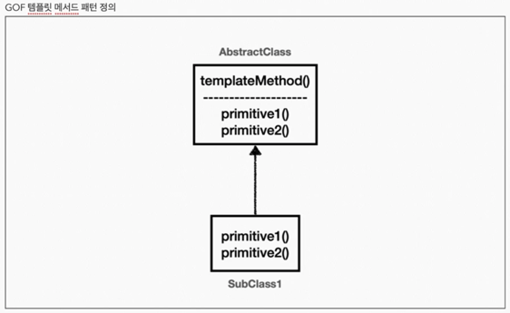

# 템플릿 메서드 패턴

* 개념
  - 템플릿 메서드는 이름 그대로 템플릿을 활용한다.  
  - 템플릿은 변하지 않는 로직이다.  
  - 부모 클래스에서 변하지 않는 템플릿 코드를 구현하고, 변하는 부분은 자식 클래스에서 오버라이딩하여 사용한다.  
  - 템플릿 메서드 패턴은 다형성을 사용해서 변하는 부분과 변하지 않는 부분을 분리하는 방법이다.
  - 작업에서 알고리즘의 골격을 정의하고, 일부 단계를 하위 클래스로 연기합니다. 템플릿 메서드를 사용하면 하위 클래가 알고리즘의 구조를 변경하지 않고도 알고리즘의 특정 단계를 재정의할 수 있습니다. - GOF
  - 풀어서 설명하면 다음과 같다. 부모 클래스에 알고리즘 골격인 템플릿을 정의하고, 일부 변경되는 로직은 자식 클래에 정의하는 것이다. 이렇게 하면 자식 클래스가 알고리즘의 전체 구조를 변경하지 않고, 특정 부분만 재정의할 수 있다.
  - 결국 상속과 오버라이딩을 통한 다형성으로 문제를 해결하는 것이다.  
   

* 장점  
  - 템플릿 코드를 재사용하고 중복 코드를 줄인다.  
  - 템플릿 코드를 변경하지 않고 상속을 받아서 구체적인 알고리즘만 변경할 수 있다.
  - 공통 처리 부분을 템플릿화 하여 단일 책임 원칙(SRP)을 지킬 수 있다. (공통 로직 변경을 쉽게 대처)  
     
* 단점  
  - 리스코프 치환 원칙을 위배할 수 있다.  
  - 오버라이딩을 통해 구현되는 메소드의 의도가 달라질 수 있으니....
  - 알고리즘 구조가 복잘할 수록 템플릿을 유지하기 힘들다.
  - 템플릿 메서드 패턴은 상속을 사용한다. 따라서 상속에서 오는 단점들을 그대로 안고간다.  
  - 특히 자식 클래스가 부모 클래스와 컴파일 시점에 강하게 결합되는 문제가 있다. 이것은 의존관계에 대한 문제이다.  
  - 자식 클래스 입장에서는 부모 클래스의 기능을 전혀 사용하지 않는다.  
  - 자식 클래스를 작성할 때 부모 클래스의 기능을 사용한 것이 있었던가?  
  - 그럼에도 불구하고 템플릿 메서드 패턴을 위해 자식 클래스는 부모 클래스를 상속 받고 있다.  
  - 상속을 받는 다는 것은 특정 부모 클래스를 의존하고 있다는 것이다. 자식 클래스의 extends 다음에 바로 부모 클래스가 코드상에 지정되어 있다.  
  - 따라서 부모 클래스의 기능을 사용하든 사용하지 않든 간에 부모 클래스를 강하게 의존하게 된다.  
  - 여기서 강하게 의존한다는 뜻은 자식 클래스의 코드에 부모 클래스의 코드가 명확하게 적혀 있다는 뜻이다.  
  - UML에서 상속을 받으면 삼각형 화살표가 자식 -> 부모 를 향하고 있는 것은 이런 의존관계를 반영하는 것이다.  
  - 자식 클래스 입장에서는 부모 클래스의 기능을 전혀 사용하지 않는데, 부모 클래스를 알아야한다. 이것은 좋은 설계가 아니다.  
  - 그리고 이런 잘못된 의존관계 때문에 부모 클래스를 수정하면, 자식 클래스에도 영향을 줄 수 있다.  
  - 추가로 템플릿 메서드 패턴은 상속 구조를 사용하기 때문에, 별도의 클래스나 익명 내부 클래스를 만들어야 하는 부분도 복잡하다.
  - 이런 부분들을 더 깔끔하게 개선하려면 어떻게 해야할까?  
  - 템플릿 메서드 패턴과 비슷한 역할을 하면서 상속의 단점을 제거할 수 있는 디자인 패턴이 바로 전략 패턴 (Strategy Pattern)이다.

---------------------------------------
* 구현 1
<pre>
<code>public abstract class TemplateMethod1 {

    public void excute() {
        long startTime = System.currentTimeMillis();

        call();  // 핵심 비즈니스 로직

        long endTime = System.currentTimeMillis();
        long resultTime = endTime - startTime;
        System.out.println("Result Time = " + resultTime);
    }

    protected abstract void call();
}</code>
</pre>

<pre>
<code>public class _Exec {
    public static void main(String[] args) {
        TemplateMethod1 t1 = new SubLoginClass1();
        t1.excute();

        TemplateMethod1 t2 = new SubLoginClass2();
        t2.excute();
    }
}

class SubLoginClass1 extends TemplateMethod1 {

    @Override
    protected void call() {
        System.out.println("로직1 실행");
    }
}

class SubLoginClass2 extends TemplateMethod1 {

    @Override
    protected void call() {
        System.out.println("로직2 실행");
    }
}</code>
</pre>
>> 문제점  
> 자식 클래스를 계속 만들어야 하는 단점이 있다. 익명 클래스를 활용하여 단점을 보완하자. 익명 내부 클래스를 사용하게 되면 인스턴스를 생성하면서 동시에 생성할 클래스를 상속 받은 자식 클래스를 정의할 수 있다.

  
* 구현 2  
멀티스레딩 환경에서 발생할 수 있는 동시성 문제 해결을 위해 syncronized 키워드를 사용한다. 그러면 동시에 여러 스레드가 메소드로 들어 올 수 없어 동시성 문제가 해결 된다.  

<pre>
<code>public class _Exec {

    public static void main(String[] args) {

        TemplateMethod1 t3 = new TemplateMethod1() {
            @Override
            protected void call() {
                System.out.println("로직3 실행");
            }
        };

    }
}</code>
</pre>