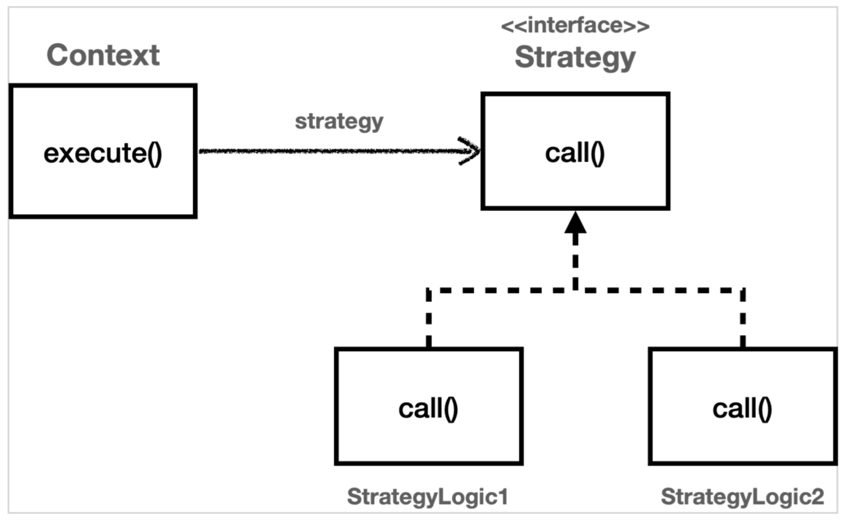
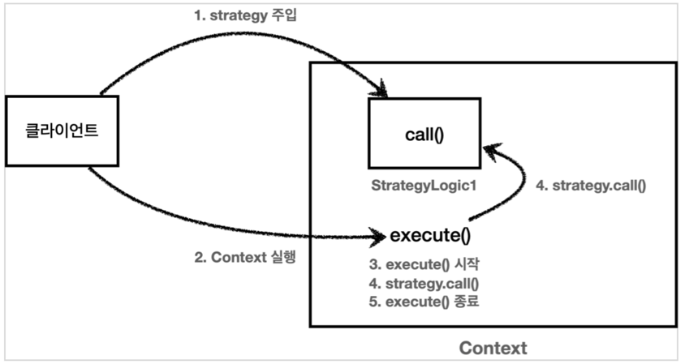
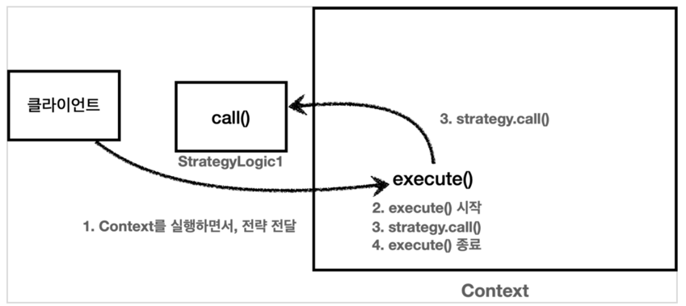

# 전략 패턴

* 개념
  - 변하지 않는 부분을 `Context` 라는 곳에 두고, 변하는 부분을 `Strategy` 라는 인터페이스를 만들고 해당 인터페이스를 구현하도록 해서 문제를 해결  
  - 템플릿은 변하지 않는 로직이다.  
  - 상속이 아니라 위임으로 문제를 해결  
  - 전략 패턴에서 `Context` 는 변하지 않는 템플릿 역할을 하고, `Strategy` 는 변하는 알고리즘 역할  
  - 핵심은 `Context` 는 `Strategy` 인터페이스에만 의존한다는 점이다. 덕분에 `Strategy` 의 구현체를 변경하거나 새로 만들어도 `Context` 코드에는 영향을 주지 않는다  
  - 스프링에서 의존관계 주입에서 사용하는 방식이 바로 전략 패턴  
  -   
   

* GOF 디자인 패턴에서 정의한 전략 패턴의 의도는 다음과 같다.
> 알고리즘 제품군을 정의하고 각각을 캡슐화하여 상호 교환 가능하게 만들자. 전략을 사용하면 알고리즘을
사용하는 클라이언트와 독립적으로 알고리즘을 변경할 수 있다.

* 장점  
  - 템플릿 코드를 재사용하고 중복 코드를 줄인다.  
  - 템플릿 코드를 변경하지 않고 상속을 받아서 구체적인 알고리즘만 변경할 수 있다.
  - 공통 처리 부분을 템플릿화 하여 단일 책임 원칙(SRP)을 지킬 수 있다. (공통 로직 변경을 쉽게 대처)  
     
* 단점  
  - 리스코프 치환 원칙을 위배할 수 있다.  
  - 오버라이딩을 통해 구현되는 메소드의 의도가 달라질 수 있으니....
  - 알고리즘 구조가 복잘할 수록 템플릿을 유지하기 힘들다.
  - 템플릿 메서드 패턴은 상속을 사용한다. 따라서 상속에서 오는 단점들을 그대로 안고간다.  
  - 특히 자식 클래스가 부모 클래스와 컴파일 시점에 강하게 결합되는 문제가 있다. 이것은 의존관계에 대한 문제이다.  
  - 자식 클래스 입장에서는 부모 클래스의 기능을 전혀 사용하지 않는다.  
  - 자식 클래스를 작성할 때 부모 클래스의 기능을 사용한 것이 있었던가?  
  - 그럼에도 불구하고 템플릿 메서드 패턴을 위해 자식 클래스는 부모 클래스를 상속 받고 있다.  
  - 상속을 받는 다는 것은 특정 부모 클래스를 의존하고 있다는 것이다. 자식 클래스의 extends 다음에 바로 부모 클래스가 코드상에 지정되어 있다.  
  - 따라서 부모 클래스의 기능을 사용하든 사용하지 않든 간에 부모 클래스를 강하게 의존하게 된다.  
  - 여기서 강하게 의존한다는 뜻은 자식 클래스의 코드에 부모 클래스의 코드가 명확하게 적혀 있다는 뜻이다.  
  - UML에서 상속을 받으면 삼각형 화살표가 자식 -> 부모 를 향하고 있는 것은 이런 의존관계를 반영하는 것이다.  
  - 자식 클래스 입장에서는 부모 클래스의 기능을 전혀 사용하지 않는데, 부모 클래스를 알아야한다. 이것은 좋은 설계가 아니다.  
  - 그리고 이런 잘못된 의존관계 때문에 부모 클래스를 수정하면, 자식 클래스에도 영향을 줄 수 있다.  
  - 추가로 템플릿 메서드 패턴은 상속 구조를 사용하기 때문에, 별도의 클래스나 익명 내부 클래스를 만들어야 하는 부분도 복잡하다.
  - 이런 부분들을 더 깔끔하게 개선하려면 어떻게 해야할까?  
  - 템플릿 메서드 패턴과 비슷한 역할을 하면서 상속의 단점을 제거할 수 있는 디자인 패턴이 바로 전략 패턴 (Strategy Pattern)이다.

---------------------------------------
* 구현 1
<pre>
<code>public class _Exec {

    public static void main(String[] args) {
        Strategy1 strategyLogic1 = new StrategyLogic1();
        ContextV1 context1 = new ContextV1(strategyLogic1);
        context1.execute();

        Strategy1 strategyLogic2 = new StrategyLogic2();
        ContextV1 context2 = new ContextV1(strategyLogic2);
        context2.execute();

        // 익명 클래스 사용
        Strategy1 strategyLogic3 = new StrategyLogic1() {
            @Override
            public void call() {
                System.out.println("비즈니스 로직3 실행");
            }
        };
        ContextV1 context3 = new ContextV1(strategyLogic3);
        context3.execute();

        // 인라인
        ContextV1 context4 = new ContextV1(new StrategyLogic1() {
            @Override
            public void call() {
                System.out.println("비즈니스 로직4 실행");
            }
        });
        context4.execute();

        // 람다
        ContextV1 context5 = new ContextV1(() -> System.out.println("비즈니스 로직5 실행"));
        context5.execute();
    }
}

class StrategyLogic1 implements Strategy1 {
    @Override
    public void call() {
        System.out.println("비즈니스 로직1 실행");
    }
}

class StrategyLogic2 implements Strategy1 {
    @Override
    public void call() {
        System.out.println("비즈니스 로직2 실행");
    }
}</code>
</pre>
> `ContextV1` 은 변하지 않는 로직을 가지고 있는 템플릿 역할을 하는 코드이다. 전략 패턴에서는 이것을 컨텍스트(문맥)이라 한다.
쉽게 이야기해서 컨텍스트(문맥)는 크게 변하지 않지만, 그 문맥 속에서 `strategy` 를 통해 일부 전략이 변경된다 생각하면 된다.
>
> `Context` 는 내부에 `Strategy strategy` 필드를 가지고 있다. 이 필드에 변하는 부분인 `Strategy` 의 구현체를 주입하면 된다.  
>  
> 전략 패턴의 핵심은 `Context` 는 `Strategy` 인터페이스에만 의존한다는 점이다. 덕분에 `Strategy` 의 구현체를 변경하거나 새로 만들어도 `Context` 코드에는 영향을 주지 않는다.

* 실행 그림

 

* 실행 결과
> StrategyLogic1 - 비즈니스 로직1 실행  
> ContextV1 - resultTime=3  
> StrategyLogic2 - 비즈니스 로직2 실행  
> ContextV1 - resultTime=0
> StrategyLogic2 - 비즈니스 로직3 실행  
> ContextV1 - resultTime=0
> StrategyLogic2 - 비즈니스 로직4 실행  
> ContextV1 - resultTime=0
> StrategyLogic2 - 비즈니스 로직5 실행  
> ContextV1 - resultTime=0

* 선 조립, 후 실행  
> 이 방식은 `Context` 와 `Strategy` 를 실행 전에 원하는 모양으로 조립해두고, 그 다음에 `Context` 를 실행하는 선 조립, 후 실행 방식에서 매우 유용하다.
`Context` 와 `Strategy` 를 한번 조립하고 나면 이후로는 `Context` 를 실행하기만 하면 된다. 우리가 스프링으로 애플리케이션을 개발할 때 애플리케이션 로딩 시점에 의존관계 주입을 통해 필요한 의존관계를 모두 맺어두고 난 다음에 실제 요청을 처리하는 것 과 같은 원리  

* 단점 
> `Context` 와 `Strategy` 를 조립한 이후에는 전략을 변경하기가 번거롭다는 점이다. 물론 `Context` 에 setter 를 제공해서 `Strategy` 를 넘겨 받아 변경하면 되지만, `Context` 를 싱글톤으로 사용할 때는 동시성 이슈 등 고려할 점이 많다. 그래서 전략을 실시간으로 변경해야 하면 차라리 이전에 개발한 테스트 코드 처럼 `Context` 를 하나더 생성하고 그곳에 다른 `Strategy` 를 주입하는 것이 더 나은 선택일 수 있다.
 
> 이렇게 먼저 조립하고 사용하는 방식보다 더 유연하게 전략 패턴을 사용하는 방법을 없을까? = V2

-----
* 구현 2
<pre>
<code>ContextV2 context6 = new ContextV2();
context6.execute(new StrategyLogic1());

// 익명 클래스 사용
ContextV2 context7 = new ContextV2();
context7.execute(new StrategyLogic1() {
    @Override
    public void call() {
        System.out.println("비즈니스 로직7 실행");
    }
});

// 람다 사용
ContextV2 context8 = new ContextV2();
context8.execute(() -> System.out.println("비즈니스 로직8 실행"));</code>
</pre>

* 설명
> context 와 Strategy 를 '선 조립 후 실행'하는 방식이 아니라 Context 를 실행할 때 마다 전략을 인수로 전달한다.  
> 클라이언트는 Context 를 실행하는 시점에 원하는 Strategy 를 전달할 수 있다. 따라서 이전 방식과 비교해서 원하는 전략을 더욱 유연하게 변경할 수 있다.  
> 테스트 코드를 보면 하나의 Context 만 생성한다. 그리고 하나의 Context 에 실행 시점에 여러 전략을 인수로 전달해서 유연하게 실행하는 것을 확인할 수 있다.  

* 정리
> ContextV1 은 필드에 Strategy 를 저장하는 방식으로 전략 패턴을 구사했다. 
>> 선 조립, 후 실행 방법에 적합하다.  
>> Context 를 실행하는 시점에는 이미 조립이 끝났기 때문에 전략을 신경쓰지 않고 단순히 실행만 하면 된다.  

> ContextV2 는 파라미터에 Strategy 를 전달받는 방식으로 전략 패턴을 구사했다.  
>> 실행할 때 마다 전략을 유연하게 변경할 수 있다.  
>> 단점 역시 실행할 때 마다 전략을 계속 지정해주어야 한다는 점이다.

> 지금 우리가 해결하고 싶은 문제는 변하는 부분과 변하지 않는 부분을 분리하는 것이다.
변하지 않는 부분을 템플릿이라고 하고, 그 템플릿 안에서 변하는 부분에 약간 다른 코드 조각을 넘겨서 실행하는 것이 목적이다.
ContextV1 , ContextV2 두 가지 방식 다 문제를 해결할 수 있지만, 어떤 방식이 조금 더 나아 보이는가? 지금 우리가 원하는 것은 애플리케이션 의존 관계를 설정하는 것 처럼 선 조립, 후 실행이 아니다. 단순히 코드를 실행할 때 변하지 않는 템플릿이 있고, 그 템플릿 안에서 원하는 부분만 살짝 다른 코드를 실행하고 싶을 뿐이다.
따라서 우리가 고민하는 문제는 실행 시점에 유연하게 실행 코드 조각을 전달하는 ContextV2 가 더 적합하다.